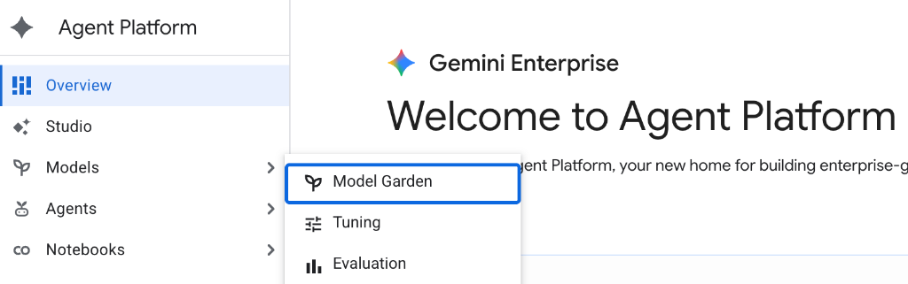
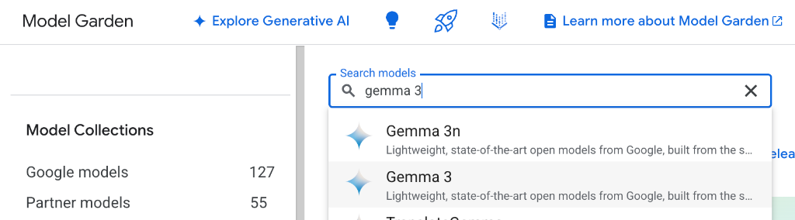
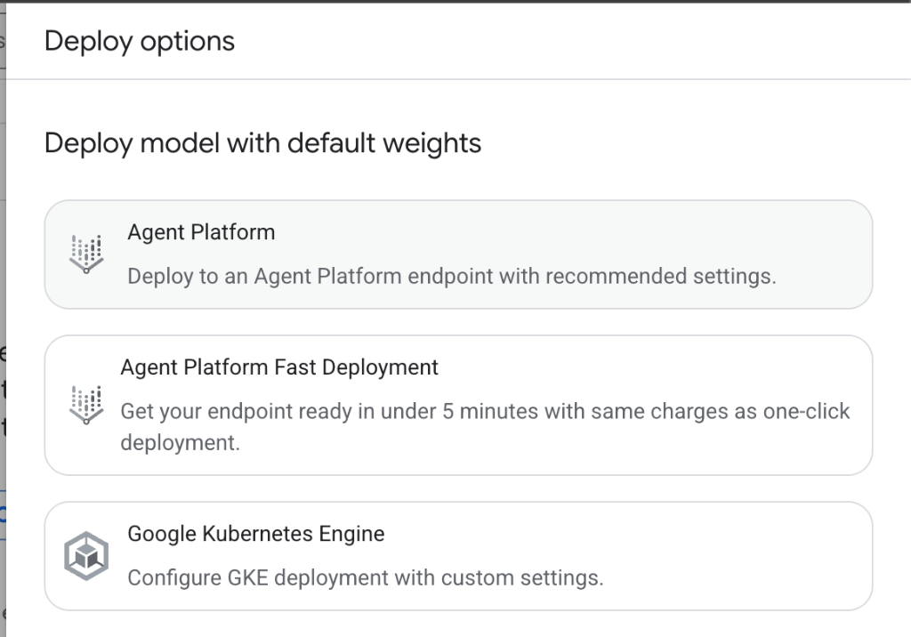
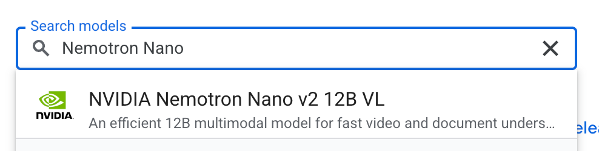
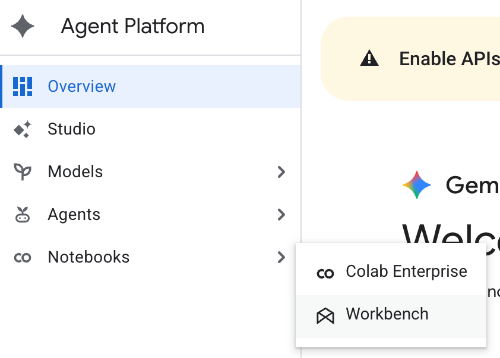
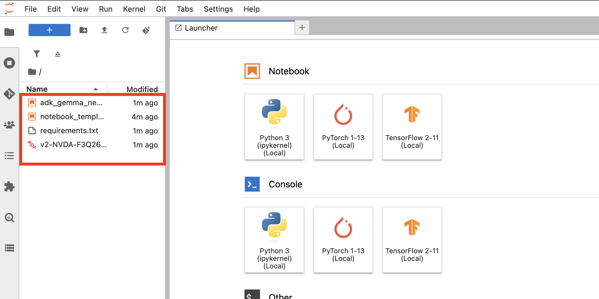
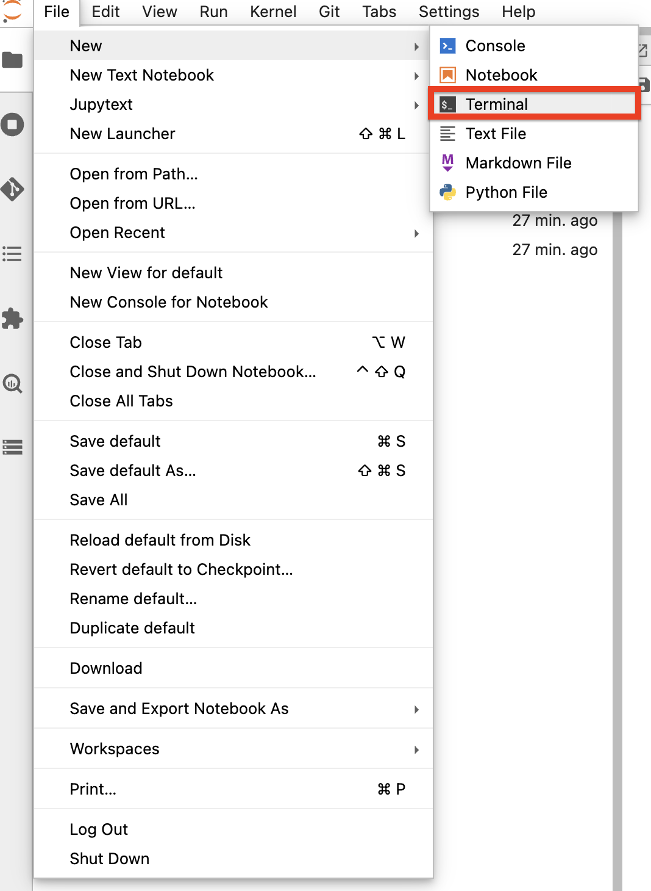

# PDF Parsing Agent with Gemma and Nemotron

This recipe builds an agentic PDF parsing workflow on Google Cloud. Gemma 3 acts as the orchestrator model, NVIDIA Nemotron Nano 12B VL extracts text from PDF page images, and Google ADK routes tool calls between the model and the PDF parsing function.

The included notebook asks financial questions about an NVIDIA quarterly presentation PDF and returns answers grounded in the document content.

## What You Deploy

- A Gemma 3 Agent Platform endpoint for orchestration.
- A Nemotron Nano 12B VL Agent Platform endpoint for PDF page extraction.
- A Jupyter environment that runs the ADK notebook.

## Prerequisites

- A Google Cloud project with billing enabled.
- Permissions to enable APIs, deploy Vertex AI / Agent Platform Model Garden models, create endpoints, and create Workbench instances if you use Vertex AI Workbench.
- GPU quota and capacity for:
  - Gemma 3: `g4-standard-48` with `1 x NVIDIA_RTX_PRO_6000`.
  - Nemotron Nano 12B VL: `g4-standard-96` with `2 x NVIDIA_RTX_PRO_6000`.
- Google Cloud SDK installed locally, or access to Cloud Shell.
- Python 3.10 or newer if you run the notebook outside Workbench.
- A local clone of this repository.

Set common environment variables:

```bash
export PROJECT_ID="<YOUR_PROJECT_ID>"
export LOCATION="us-central1"

gcloud config set project "${PROJECT_ID}"
gcloud services enable \
  aiplatform.googleapis.com \
  compute.googleapis.com \
  notebooks.googleapis.com \
  serviceusage.googleapis.com
```

## Files

- `notebooks/adk_gemma_nemotron_pdf_parsing_agent.ipynb`: ADK notebook that defines the Gemma model adapter, Nemotron PDF extraction tool, and agent runner.
- `notebooks/requirements.txt`: Python dependencies for the notebook.
- `notebooks/v2-NVDA-F3Q26-Quarterly-Presentation.pdf`: Sample financial presentation used by the notebook.
- `images/`: Screenshots for the Model Garden and Workbench setup flow.

## Deploy Gemma 3

1. In the Google Cloud console, open **Agent Platform > Model Garden**.

   

2. Search for **Gemma 3** and select the Gemma 3 model card.

   

3. Accept the model terms if prompted.
4. Click **Deploy model**, then select **Agent Platform**.

   

5. In the deployment settings, use the same `LOCATION` you exported earlier.
6. Use the recommended accelerator configuration: `1 x NVIDIA_RTX_PRO_6000`, which maps to `g4-standard-48`.
7. Deploy the model and wait until the endpoint is ready.

Record the Gemma endpoint display name. The notebook default is:

```text
gemma-3-12b-it-mg-one-click-deploy
```

## Deploy Nemotron Nano 12B VL

1. In **Agent Platform > Model Garden**, search for **Nemotron**.
2. Select **Nvidia Nemotron Nano v2 12B VL**.

   

3. Accept the model terms if prompted.
4. Deploy the model to an Agent Platform endpoint using `2 x NVIDIA_RTX_PRO_6000`, which maps to `g4-standard-96`.

You can deploy from the console, or use the API:

```bash
export MODEL="publishers/nvidia/models/nemotron-nano-12b-v2-vl@1.5.0"
export ENDPOINT="${LOCATION}-aiplatform.googleapis.com"

curl \
  -X POST \
  -H "Authorization: Bearer $(gcloud auth print-access-token)" \
  -H "Content-Type: application/json" \
  -H "X-Goog-User-Project: ${PROJECT_ID}" \
  "https://${ENDPOINT}/v1beta1/projects/${PROJECT_ID}/locations/${LOCATION}:deploy" \
  -d '{
    "publisher_model_name": "'"${MODEL}"'",
    "endpoint_config": {
      "dedicated_endpoint_disabled": true
    },
    "deploy_config": {
      "dedicated_resources": {
        "machine_spec": {
          "machine_type": "g4-standard-96",
          "accelerator_type": "NVIDIA_RTX_PRO_6000",
          "accelerator_count": 2
        }
      }
    }
  }'
```

Wait until the endpoint is ready, then record the Nemotron endpoint display name. The notebook default is:

```text
nvidia_nemotron-nano-12b-v2-vl_1_5_0-mg-one-click-deploy
```

## Run the Notebook

You can run the notebook in Vertex AI Workbench, Cloud Shell Editor, or a local Jupyter environment. Vertex AI Workbench is the most convenient option if you want a managed notebook environment in the same project.

### Option A: Vertex AI Workbench

1. In the Google Cloud console, open **Agent Platform > Notebooks > Workbench**.

   

2. Create an instance, or open an existing instance.
3. Upload these files into the same directory:

   - `notebooks/adk_gemma_nemotron_pdf_parsing_agent.ipynb`
   - `notebooks/requirements.txt`
   - `notebooks/v2-NVDA-F3Q26-Quarterly-Presentation.pdf`

   

4. Open the notebook.
5. From the Jupyter menu, open **File > New > Terminal**.

   

6. Authenticate Application Default Credentials:

   ```bash
   gcloud auth application-default login
   ```

### Option B: Local Jupyter

From this recipe directory:

```bash
cd agentic/agent-platform/pdf-parsing-agent/notebooks
python3 -m venv .venv
source .venv/bin/activate
pip install --upgrade pip
pip install -r requirements.txt jupyter
gcloud auth application-default login
jupyter notebook adk_gemma_nemotron_pdf_parsing_agent.ipynb
```

## Configure and Execute the Agent

1. Run the notebook setup cells.
2. Run the endpoint listing cell. It prints available endpoint display names in your configured region.
3. Update the configuration cell:

   ```python
   LOCATION = "us-central1"
   GEMMA_ENDPOINT_NAME = "gemma-3-12b-it-mg-one-click-deploy"
   VLM_ENDPOINT_NAME = "nvidia_nemotron-nano-12b-v2-vl_1_5_0-mg-one-click-deploy"
   ```

4. Continue running the notebook cells to:
   - Initialize Vertex AI.
   - Render the PDF pages to images.
   - Define `parse_pdf_tool`.
   - Create the ADK `Agent` and `Runner`.
   - Ask the sample financial question.

The final notebook cell asks:

```text
Please parse v2-NVDA-F3Q26-Quarterly-Presentation.pdf and tell me what were NVIDIA's Revenue ($) and Net Income ($) in Q3 FY26 were, and how did they compare to Revenue ($) and Net Income ($) in Q3 FY25?
```

Gemma should call the PDF parsing tool, Nemotron should extract content from the PDF page images, and the agent should return a grounded answer.

## Cleanup

Delete the Agent Platform endpoints you created. You can do this from **Agent Platform > Models > Endpoints**, or with `gcloud` after finding the endpoint IDs:

```bash
gcloud ai endpoints list --region="${LOCATION}"
gcloud ai endpoints delete "<ENDPOINT_ID>" --region="${LOCATION}" --quiet
```

If you created a Workbench instance for this recipe, delete it:

```bash
export WORKBENCH_LOCATION="<YOUR_WORKBENCH_LOCATION>"

gcloud workbench instances list --location="${WORKBENCH_LOCATION}"
gcloud workbench instances delete "<INSTANCE_NAME>" \
  --location="${WORKBENCH_LOCATION}" \
  --quiet
```

Review your project for any remaining disks, endpoints, notebooks, or deployed model resources to avoid ongoing charges.
