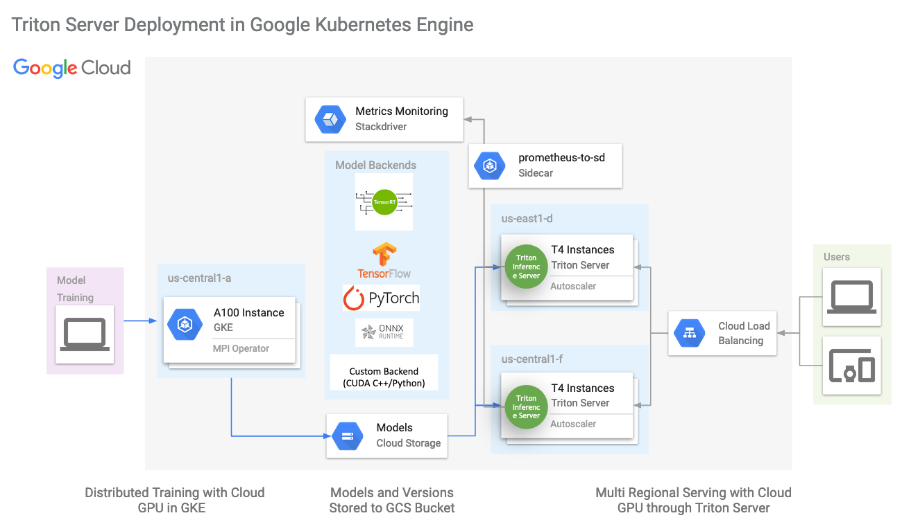
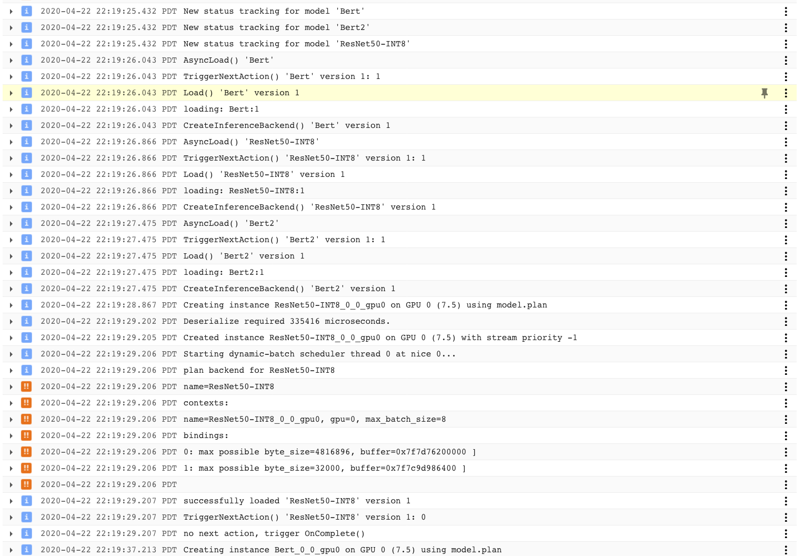
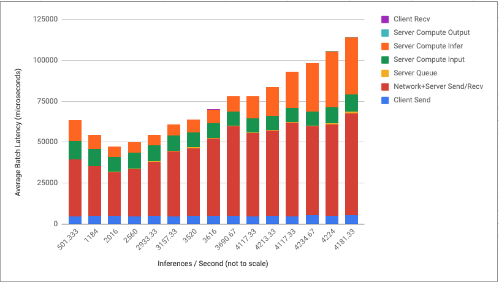
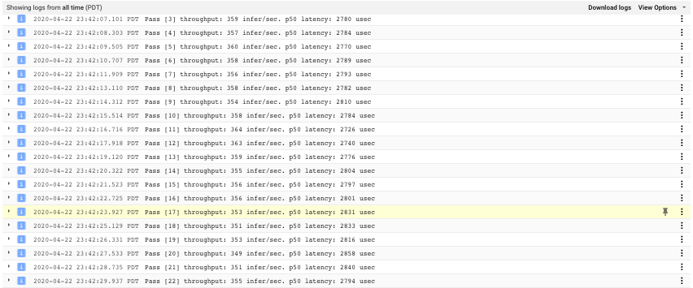
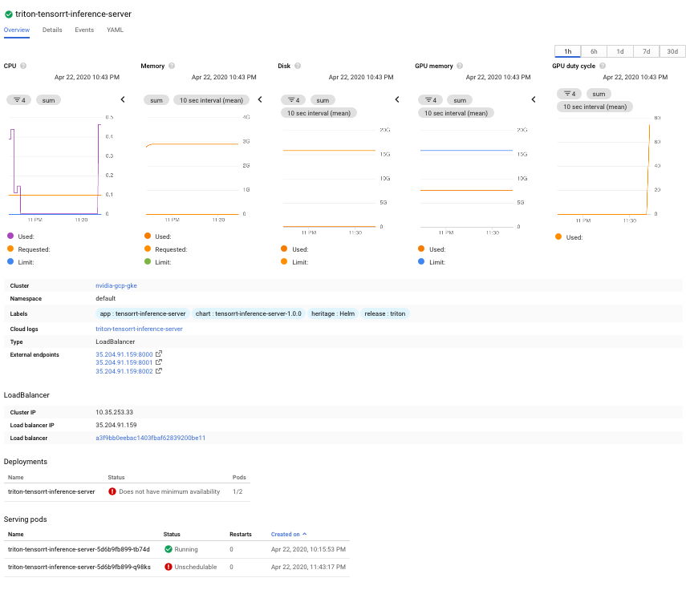
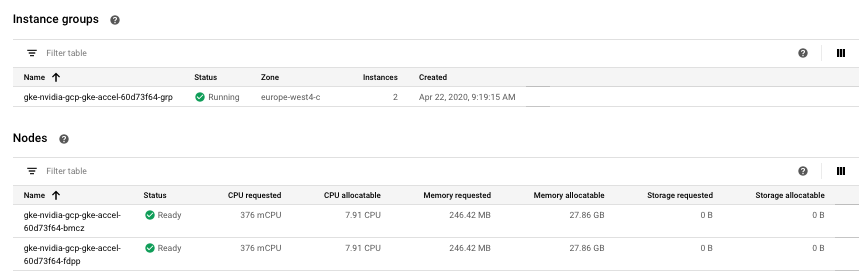

# Serving TensorRT optimized Deep Learning Models with NVIDIA GPU in GKE

## Sample Overview

This a sample to optimize, serve and analyze Deep Learning models running on NVIDIA GPU in GKE. It covers:
* Convert TF Checkpoints and ONNX model with TensorRT(TRT) optimization 
* TRT model configuration in Triton, dynamic batching with latency budget
* Deploy TRITON with a helm chart 
* Export TRITON Prometheus metric as custom metric
* TRITON serving performance analysis with TRITON Perf Analyzer 
* AutoScale TRITON Services with required SLAs or GPU metrics
* Detailed performance stats: Resnet50 ~4kqps at ~100ms latency, Bert Large Seq384 ~170qps at 125ms latency  



**Resources:** 
* TRITON Documentation: [TRITON docs](https://docs.nvidia.com/deeplearning/sdk/tensorrt-inference-server-guide/docs/)
* Generate TensorRT BERT model: [TensorRT BERT Demo](https://github.com/NVIDIA/TensorRT/tree/master/demo/BERT)

## GCP Environment Setup

#### Deploy GKE cluster with T4 node pools

Replace GCP project and cluster name to your own choice
``` bash
export PROJECT_ID=[YOU GCP Project]
export ZONE='us-central1-a'
export DEPLOYMENT_NAME='nvidia-gcp-gke'
export NODE_LOCATION='us-central1-a'

gcloud beta container clusters create ${DEPLOYMENT_NAME} \
--addons=HorizontalPodAutoscaling,HttpLoadBalancing,Istio,ApplicationManager,GcePersistentDiskCsiDriver \
--machine-type=n1-standard-4 \
--cluster-version=1.18.10-gke.601 --zone=${ZONE} \
--release-channel rapid \
--node-locations=${ZONE} --num-nodes=1 \
--subnetwork=default \
--enable-stackdriver-kubernetes \
--scopes cloud-platform

# to be able operate on the GKE cluster from laptop client.
gcloud container clusters get-credentials ${DEPLOYMENT_NAME} \
  --project ${PROJECT_ID} \
  --zone ${ZONE}

gcloud container node-pools create accel \
  --project ${PROJECT_ID} \
  --zone ${ZONE} \
  --cluster ${DEPLOYMENT_NAME} \
  --accelerator type=nvidia-tesla-t4,count=1 \
  --num-nodes 1 \
  --machine-type n1-standard-8 \
  --disk-size=100 \
  --scopes cloud-platform \
  --enable-autoscaling --min-nodes 1 --max-nodes 3 \
  --enable-autorepair \
  --verbosity error

# nvidia driver
kubectl apply -f https://raw.githubusercontent.com/GoogleCloudPlatform/container-engine-accelerators/master/nvidia-driver-installer/cos/daemonset-preloaded.yaml

# install helm 3 locally (after get the credentials) 
# on CloudShell, do this:
curl https://raw.githubusercontent.com/helm/helm/master/scripts/get-helm-3 | bash
```

## Build BERT and Resnet50 model with TensorRT 7.1 
The code for this chapter resides in /triton_gke/triton_server/tensorrt

In this section, we pull pretrained NGC model from NVIDIA cloud and use a NGC TensorRT container to convert a pretrained NGC BERT checkpoint fine tuned on SQUAD Q&A task to TRT engine. The instruction is provided through [TensorRT BERT Demo](https://github.com/NVIDIA/TensorRT/tree/master/demo/BERT). Also we will download a Resnet50 ONNX model and convert it to TensorRT INT8 engine. Since T4 GPU support INT8 precision, ideally we want the TensorRT engine to launch IMMA kernels that will run on TensorCores. 

In following yaml file, please modify `command: ["gcsfuse", "--only-dir", "bert", "dlvm-dataset", "/mnt/bert"]` to change `bert` to the GCS folder you like to use and `dlvm-dataset`  to your GCS bucket.

```bash
kubectl create -f run_tensorrt_optimization.yaml
```

Log could be viewed by:
```bash
kubectl get pods --all-namespaces|grep tensorrt 
kubectl logs -f tensorrt-conversion-d6b5b6b6b-rc59w #replace pod name
```

Generated example TRT BERT engine file is at `trt_engine/bert_large_384_int8.engine`, in this case, it is a BERT Large model with input sequence length of 384. And generated Resnet50 engine file is at `trt_engine/resnet50_8-16-32_int8.engine`

## Setup Triton Model repository
The code for this chapter resides in /triton_gke/triton_server/model_repository

We copy the TRT engine we got from first chapter and build a model
repository at a GCS directory, for example:
`gs://dlvm-dataset/model_repository`
with following structure as in `\triton_server\model_repository`:
```
    ├── Bert
    │   ├── 1
    │   │   └── model.plan
    │   └── config.pbtxt   
    ├── Bert2
    │   ├── 1
    │   │   └── model.plan
    │   └── config.pbtxt      
    ├── ResNet50-INT8
    │   ├── 1
    │   │   └── model.plan
    │   └── config.pbtxt
    └── ResNet50-INT8-2
        ├── 1
        │   └── model.plan
        └── config.pbtxt
```

Engine could be copied through:
```bash
gsutil -m cp -r triton_server/model_repository gs://dlvm-dataset/model_repository
gsutil cp gs://dlvm-dataset/bert/trt_engine/bert_large_384_int8.engine gs://dlvm-dataset/model_repository/Bert/1/model.plan
gsutil cp gs://dlvm-dataset/bert/trt_engine/bert_large_384_int8.engine gs://dlvm-dataset/model_repository/Bert-2/1/model.plan
gsutil cp gs://dlvm-dataset/bert/trt_engine/resnet50_8-16-32_int8.engine gs://dlvm-dataset/model_repository/ResNet50-INT8/1/model.plan
gsutil cp gs://dlvm-dataset/bert/trt_engine/resnet50_8-16-32_int8.engine gs://dlvm-dataset/model_repository/ResNet50-INT8-2/1/model.plan 
```

For those who interested in the configuration file, since Resnet50 input is image binary data whose size is relatively large, it is recommended to configure multiple model instance (in `config.pbtxt` provided), to offset compute and H2D memcopy. User can observer the difference by comparing inference result by pointing requests to `ResNet50-INT8` and `ResNet50-INT8-2`. On the other hand, with text input, BERT large model can observe less significant improvement by multi-instance, it still helps.

## Configure TRITON Server with Helm Chart
The code for this chapter resides in /triton_gke/triton_server

#### Set up TRITON Server
To deploy a Triton server to GKE, modify modelRepositoryPath in values.yaml to point to the model location, as well as the container image name. 
```
cd triton_server/triton-inference-server
helm install triton . 
```

After the service has successfully deployed, go to the triton service in GKE console, you will observe:


## Build Triton client image

In this sample, we will provide 2 examples as Triton clients: 
*  a tensorflow notebook client for Q&A demo also with terminal interface to submit customized perf client request
*  a perf client deployment that is generating bulk volume to trigger autoscaler. 

To build client image, we run following scripts by using ngc triton client image as base for client deployment.
```bash
cd triton_client/notebook_client/docker
bash build.sh
```

#### Set up Triton client
```
cd triton_client/notebook_client
kubectl create -f jupyter.yaml
```
click url:8888 to enter the notebook, enter password `gcp`

#### Demonstrate Triton multi instance performance with BERT base and Resnet50 INT8

TensorRT offer multiple optimization profiles, each profile specify the batch size (min, opt, max) for input of TRT engine, for the best performance, it is recommended to build multiple optimization profiles each with a optimal batch size and choose the right profile with desired inference batch size in Triton model configuration. With min batch size set to 1, we are able to utilize dynamic batching feature in Triton.
 
In the case of Resnet50, we add 3 optimization profiles, with (min, opt, max) set to (1, 8, 32), (1, 16, 32) and (1, 32, 32). And in Triton config, in `ResNet50-INT8-2`, we choose to use profile `2` which allow optimal batch size at `32`, and we configure dynamic batching so that Triton model will accept arbituary input batch size. Then, we can send request to both `ResNet50-INT8` and `ResNet50-INT8-2` to compare the performance difference.

Then, we will compare `Bert` with dynamic batch size of `16`, with 1 model instance in GPU memory `Bert-2` with 2 instances in GPU memory. 

Open a new terminal in Jupyter Notebook, new -> terminal. Modify the IP in command below to match your triton server IP address (from GKE service dashboard)
Query 1 model instance
`bash ./query_bert.sh Bert 35.204.91.159`
Query 2 model instance
`bash ./query_bert.sh Bert-2 35.204.91.159`

Now try the same on Resnet50 Model:
Query 1 model instance
`bash ./query_resnet.sh ResNet50-INT8 35.204.91.159`
Query 2 model instance
`bash ./query_resnet.sh ResNet50-INT8-2 35.204.91.159`

We observe that:
1 instance resnet50
```
Concurrency: 1, throughput: 565.333 infer/sec, latency 60001 usec
Concurrency: 2, throughput: 1216 infer/sec, latency 66442 usec
Concurrency: 3, throughput: 1706.67 infer/sec, latency 77101 usec
Concurrency: 4, throughput: 2048 infer/sec, latency 88032 usec
Concurrency: 5, throughput: 2357.33 infer/sec, latency 111096 usec
Concurrency: 6, throughput: 2858.67 infer/sec, latency 109348 usec
Concurrency: 7, throughput: 2986.67 infer/sec, latency 95868 usec
Concurrency: 8, throughput: 2901.33 infer/sec, latency 116152 usec
Concurrency: 9, throughput: 2880 infer/sec, latency 177276 usec
Concurrency: 10, throughput: 3061.33 infer/sec, latency 169798 usec
```

GPU utilization
```text
# EntityId      GPUTL       MCUTL  DRAMA  SMACT  SMOCC  TENSO                 PCITX                 PCIRX
    GPU 2          79          43  0.382  0.652  0.206  0.267             273834455            2258816847
    GPU 2          92          50  0.333  0.553  0.175  0.227             241553009            1988613613
    GPU 2          93          51  0.335  0.562  0.178  0.231             238690016            1964181534
```

4 instances resnet50
```
Concurrency: 1, throughput: 544 infer/sec, latency 63754 usec
Concurrency: 2, throughput: 1280 infer/sec, latency 64933 usec
Concurrency: 3, throughput: 1984 infer/sec, latency 60547 usec
Concurrency: 4, throughput: 2506.67 infer/sec, latency 61568 usec
Concurrency: 5, throughput: 2933.33 infer/sec, latency 72380 usec
Concurrency: 6, throughput: 3125.33 infer/sec, latency 79613 usec
Concurrency: 7, throughput: 3456 infer/sec, latency 83438 usec
Concurrency: 8, throughput: 3637.33 infer/sec, latency 90568 usec
Concurrency: 9, throughput: 3594.67 infer/sec, latency 105748 usec
Concurrency: 10, throughput: 4053.33 infer/sec, latency 99167 usec
```

GPU utilization
```text
# EntityId      GPUTL       MCUTL  DRAMA  SMACT  SMOCC  TENSO                 PCITX                 PCIRX 
    GPU 2          97          63  0.423  0.742  0.235  0.323             455485768            3767994735
    GPU 2          73          49  0.494  0.934  0.305  0.439             712288639            5924432656
    GPU 2          97          61  0.458  0.830  0.270  0.382             624731865            5184262455
```

Bert GPU utilization:
```text
# EntityId      GPUTL       MCUTL  DRAMA  SMACT  SMOCC  TENSO                 PCITX                 PCIRX
    GPU 2          99          36  0.280  0.986  0.274  0.540             499974406            4249275499
    GPU 2          93          35  0.278  0.959  0.267  0.525             492584878            4200994163
    GPU 2          99          36  0.277  0.995  0.276  0.546             494920560            4204315331
``` 

Quickly going through key points in the observation:
*  Dynamic batching: we observe large latency when concurrency is low, meaning engine is waiting for batch in the queue then proceed with inference run
*  Performance: we observe ~90% SM activity(SMACT) and ~40% TensorCore utilization(TENSO) with 4 instances of TRT engine comparing with ~60% SM activity and ~25% TensorCore usage with 1 instance. BERT GPU utilization will be even better.

We can further break down the Triton performance as shown below: 


## Test out auto scaling feature in Triton

#### Enable Stackdriver
make sure in IAM you have gke-cluster-admin

``` bash
# grant user the ability to create authroization roles
kubectl create clusterrolebinding cluster-admin-binding \
    --clusterrole cluster-admin --user "$(gcloud config get-value account)"
     
# autoscaler, enable stack driver access 
kubectl apply -f https://raw.githubusercontent.com/GoogleCloudPlatform/k8s-stackdriver/master/custom-metrics-stackdriver-adapter/deploy/production/adapter.yaml
```

#### deploy HPA to enable auto scaling, with GCP Stack Driver
```bash
kubectl create -f triton_gke/triton_server/autoscaling_server/hpa.yaml
```

#### Use perf client deployment to send volume request to Triton
In `/triton_gke/triton_client/perf_client_deployment/perf_client_deployment_bert.yaml` modify the server IP address from `35.204.91.159` to your Triton service IP

Run `kubectl create -f triton_gke/triton_client/perf_client_deployment/perf_client_deployment_bert.yaml` to sent 2 concurrent bulk request to Triton server. Go to `triton-bert` deployment and look at pod log to confirm perf client is running.


We will then observe deployment is trying to provision addtional trition server pod, since current GPU node pool only contains 1 GPU node, it is unschedulable.


Then the node pool will autoscale to 2 nodes.


At the end Triton deployment finally is able to privision 2 serving pods. 


