# Accelerate Robot Learning with NVIDIA Isaac Lab and Newton on Google Cloud

## Overview

This sample shows how to run a robot-learning workflow with [NVIDIA Isaac Lab](https://isaac-sim.github.io/IsaacLab/main/index.html), [NVIDIA Isaac Sim](https://developer.nvidia.com/isaac/sim), and the [Newton Physics Engine](https://developer.nvidia.com/newton-physics) on Google Cloud. The workflow uses an NVIDIA Isaac Sim Development Workstation from Google Cloud Marketplace on a G4 instance with an NVIDIA RTX PRO 6000 GPU.

You will deploy the workstation, connect to a remote accelerated desktop with ThinLinc, install the included Newton/Isaac Lab tutorial assets, run baseline simulation scripts, modify task parameters, and evaluate a pre-trained Franka cube policy.

## Prerequisites

- A Google Cloud project with billing enabled.
- Permissions to enable APIs, deploy Marketplace solutions, create Compute Engine resources, create firewall rules, and create service accounts.
- Google Cloud SDK installed locally, or access to Cloud Shell.
- NVIDIA Isaac Sim Development Workstation terms accepted in Google Cloud Marketplace.
- G4 quota and capacity in the zone where you deploy the workstation. This sample was written for the NVIDIA RTX PRO 6000 GPU.
- A local clone of this repository.

Set your project and target zone:

```bash
export PROJECT_ID=<YOUR_PROJECT_ID>
export ZONE=<YOUR_ZONE>
export DEPLOYMENT_NAME=isaacsim-workstation
export VM_NAME=isaacsimworkstation-vm

gcloud config set project "${PROJECT_ID}"
```

Enable the baseline Google Cloud APIs:

```bash
gcloud services enable \
  compute.googleapis.com \
  cloudresourcemanager.googleapis.com \
  iam.googleapis.com \
  serviceusage.googleapis.com
```

## Task 1. Deploy the Isaac Sim Development Workstation

1. In the Google Cloud console navigation menu, open **Marketplace**.

   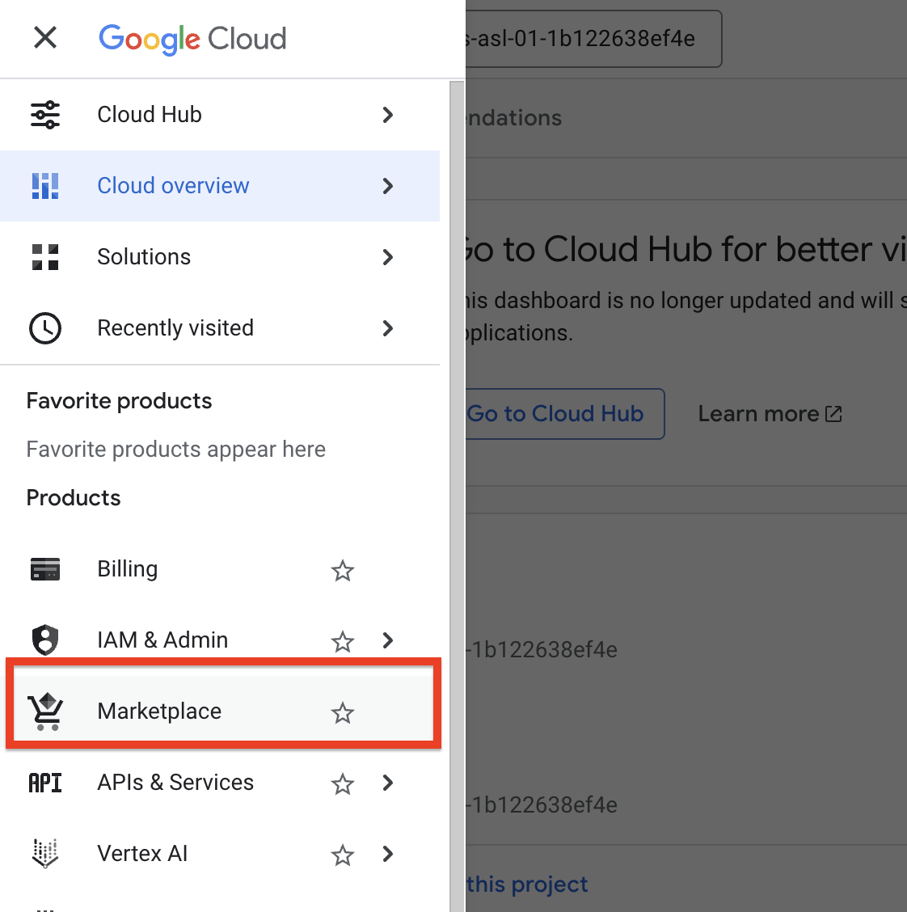

2. Search for `IsaacSim`.

   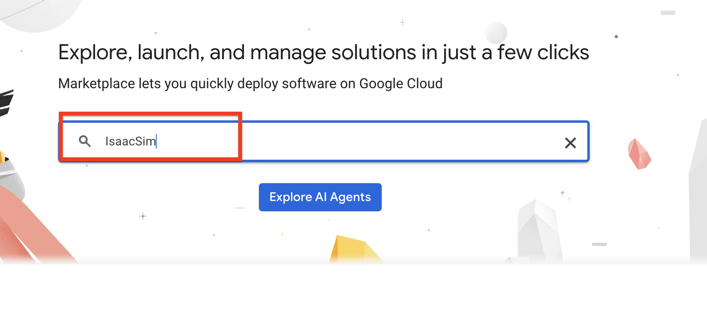

3. Select **NVIDIA Isaac Sim Development Workstation (Linux)**.

   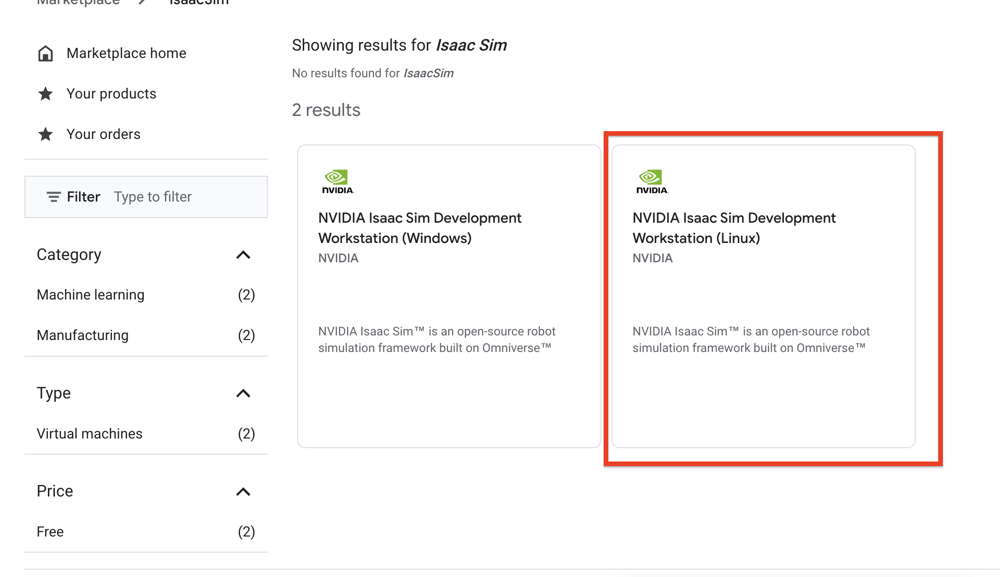

4. Click **Get Started**.

   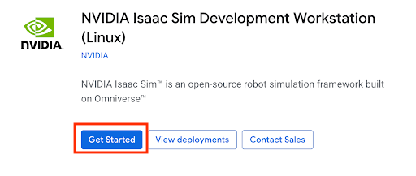

5. Accept the terms and agreements, then click **Agree**.

   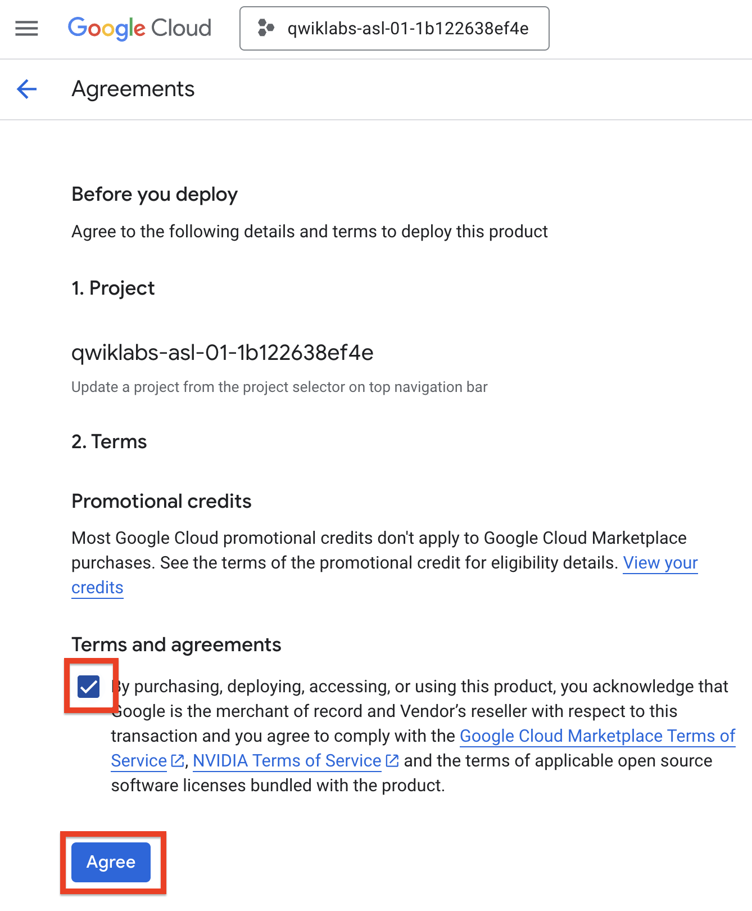

6. Click **Deploy** to open the workstation deployment wizard.

   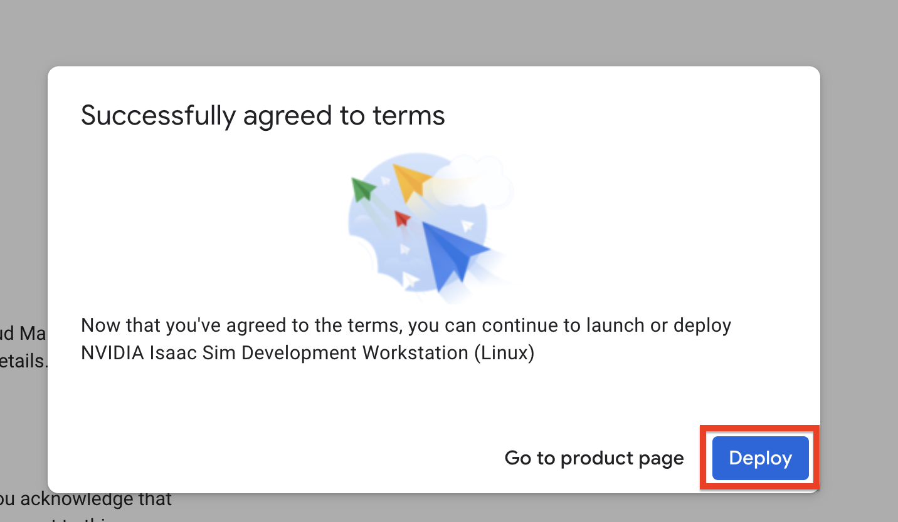

7. If prompted, click **Enable** to enable the required APIs.

   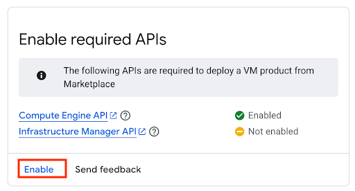

8. In the **New NVIDIA Isaac Sim Development Workstation (Linux) deployment** dialog, set the following parameters:

   - **Deployment name**: `isaacsim-workstation`
   - **Service Account ID**: `isaacsim-workstation`
   - **Zone**: the zone you exported as `ZONE`

   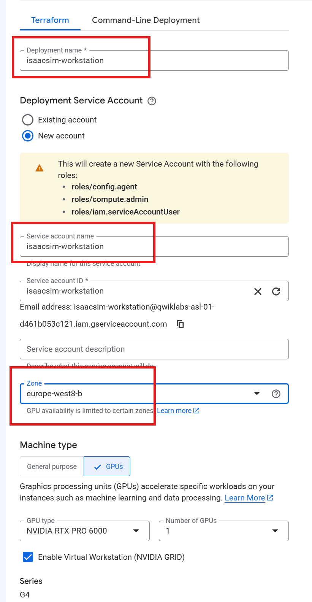

9. Click **Deploy**. The deployment can take several minutes.

If service account creation fails, retry the deployment in the same zone and select the service account that was created by the first attempt.

## Task 2. Connect to the VM and set the Ubuntu password

1. In the Google Cloud console, open **Compute Engine** > **VM instances**.

2. Click **SSH** for the `isaacsimworkstation-vm` instance.

3. In the SSH session, set a password for the `ubuntu` user. You will use this account for the ThinLinc desktop login.

   ```bash
   sudo passwd ubuntu
   ```

## Task 3. Upload the sample assets

From your local terminal or Cloud Shell, change into this sample directory:

```bash
cd physical-ai/compute-engine/isaac-lab-newton
```

Upload the ThinLinc installer script and Newton tutorial archive to the workstation:

```bash
gcloud compute scp \
  scripts/thinlinc.sh \
  scripts/newton-gcn.tar.gz \
  ubuntu@"${VM_NAME}":~/ \
  --zone="${ZONE}" \
  --project="${PROJECT_ID}"
```

## Task 4. Install ThinLinc

In the SSH session connected to the workstation, run:

```bash
cd ~
chmod +x thinlinc.sh
bash ./thinlinc.sh
```

Create a firewall rule for ThinLinc web access. For production or shared environments, restrict `SOURCE_RANGE` to your client IP address instead of `0.0.0.0/0`.

```bash
export SOURCE_RANGE=0.0.0.0/0

gcloud compute firewall-rules create allow-thinlinc \
  --project="${PROJECT_ID}" \
  --network=default \
  --direction=INGRESS \
  --priority=1000 \
  --action=ALLOW \
  --rules=tcp:300 \
  --source-ranges="${SOURCE_RANGE}"
```

Get the workstation URL:

```bash
export VM_EXTERNAL_IP=$(gcloud compute instances describe "${VM_NAME}" \
  --project="${PROJECT_ID}" \
  --zone="${ZONE}" \
  --format="value(networkInterfaces[0].accessConfigs[0].natIP)")

echo "https://${VM_EXTERNAL_IP}:300"
```

Open the URL in your browser. You may need to accept the browser warning for the self-signed certificate.

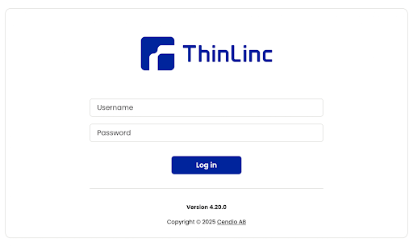

Log in with:

- **Username**: `ubuntu`
- **Password**: the password you set with `sudo passwd ubuntu`

When the Login Chooser appears, click **Start**. The desktop appears after a few minutes.

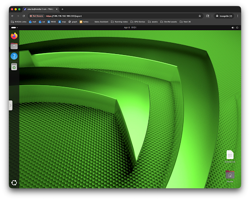

## Task 5. Install Newton and the Isaac Lab tutorial assets

From the ThinLinc desktop, open the start menu.

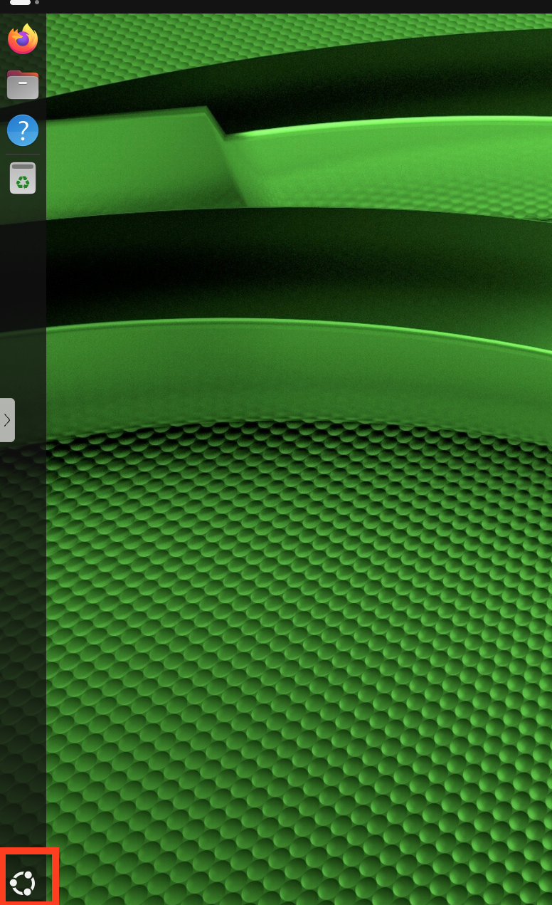

Open a terminal.

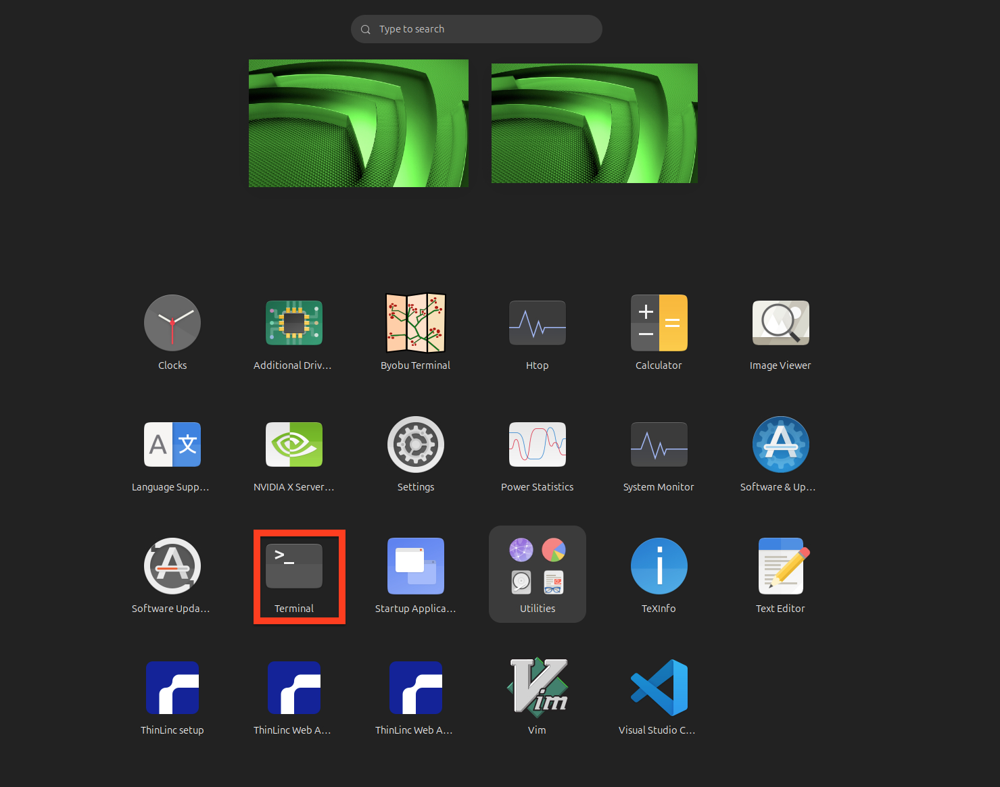

When copying commands from your browser into the remote desktop, use the ThinLinc clipboard control on the left side of the browser window.

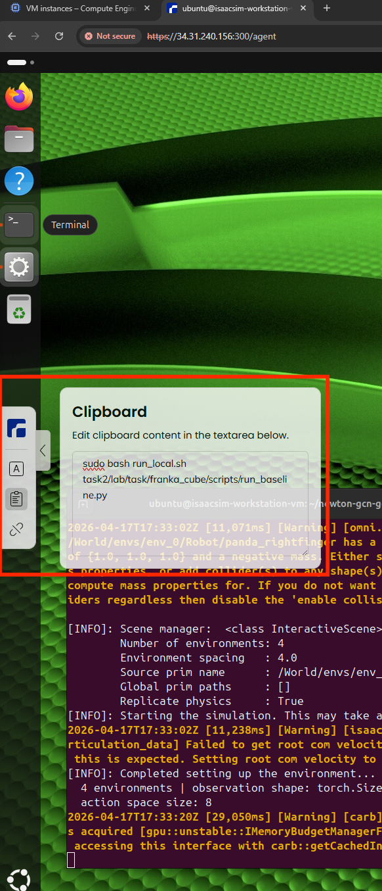

Extract the tutorial workspace:

```bash
cd ~
tar -xf newton-gcn.tar.gz
cd newton-gcn-gcn_instructions
```

Set up the local environment:

```bash
bash setup_local.sh
```

Verify the pre-trained policy file is present:

```bash
ls -lh task2/lab/task/franka_cube/source/franka_cube/franka_cube/tasks/direct/franka_cube/model_400.pt
```

Expected size is approximately 1.3 MB.

## Task 6. Run simulations

Run the baseline simulation:

```bash
sudo bash run_local.sh task2/lab/task/franka_cube/scripts/run_baseline.py
```

Run the script that controls a single robot joint:

```bash
sudo bash run_local.sh task2/lab/task/franka_cube/scripts/run_explore_joint.py
```

Edit the joint exploration script:

```bash
xdg-open task2/lab/task/franka_cube/scripts/run_explore_joint.py
```

After the Isaac Lab imports, find the TODO section and change `JOINT_INDEX` and `JOINT_VALUE`. For example:

```python
JOINT_INDEX = 1
JOINT_VALUE = 1.0
```

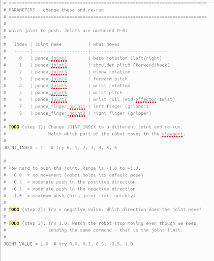

Save the file and run it again:

```bash
sudo bash run_local.sh task2/lab/task/franka_cube/scripts/run_explore_joint.py
```

Run the script that places the cube in a random location:

```bash
sudo bash run_local.sh task2/lab/task/franka_cube/scripts/run_explore_cube.py
```

Edit the cube exploration script:

```bash
xdg-open task2/lab/task/franka_cube/scripts/run_explore_cube.py
```

Change `CUBE_X_RANGE` and `CUBE_Y_RANGE` to control the randomization range. Setting both ranges to `(0, 0)` locks the cube position.

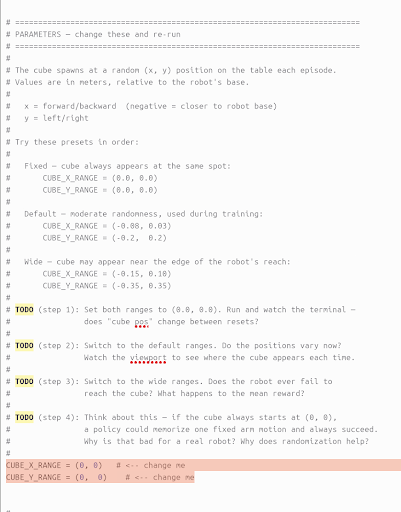

Save the file and run it again:

```bash
sudo bash run_local.sh task2/lab/task/franka_cube/scripts/run_explore_cube.py
```

Run the pre-trained cube grasping policy:

```bash
sudo bash run_local.sh task2/lab/task/franka_cube/scripts/run_policy.py
```

## Cleanup

Delete the ThinLinc firewall rule:

```bash
gcloud compute firewall-rules delete allow-thinlinc --project="${PROJECT_ID}"
```

Delete the Marketplace deployment from the Google Cloud console, or delete the VM directly:

```bash
gcloud compute instances delete "${VM_NAME}" \
  --project="${PROJECT_ID}" \
  --zone="${ZONE}"
```

Review your project for any remaining disks, IP addresses, service accounts, or deployment resources created by the Marketplace solution.

## Notes

- The included `scripts/newton-gcn.tar.gz` archive contains the Isaac Lab tutorial workspace and pre-trained Franka cube policy used by the simulation steps.
- For the latest product documentation, see the NVIDIA Isaac Sim, Isaac Lab, and Newton documentation linked above.
